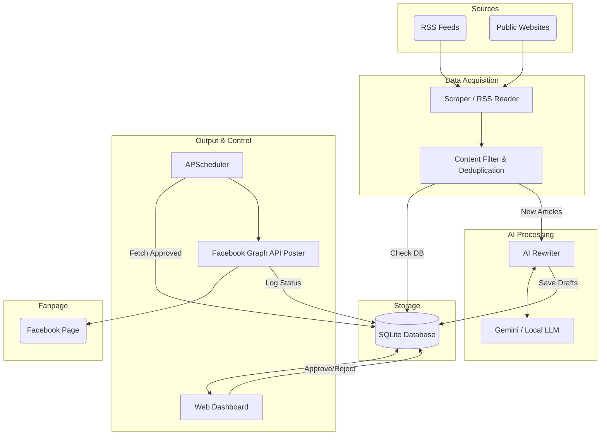

# 🏗️ System Architecture | Kiến Trúc Hệ Thống

 

---

## 🇬🇧 English

### 1. Executive Summary
The **Auto-Fanpage AI Assistant** is a background service designed to run autonomously on a Local Machine, VPS, or Raspberry Pi. The system is responsible for aggregating news from public sources (RSS/Websites), leveraging Large Language Models (LLMs like Gemini Flash or Local equivalents) to rewrite content based on pre-configured tones (e.g., humorous, sensational, professional), and automatically publishing to a Facebook Fanpage via the official Graph API. The MVP includes a manual draft approval workflow before transitioning to full automation.

### 2. Goals and Non-Goals
**Goals:**
* Autonomously scrape news from RSS feeds and public websites.
* Extract core content and summarize/rewrite using AI APIs.
* Apply specified writing tones, and auto-append relevant hashtags and emojis.
* Persist post states (Draft, Approved, Posted, Failed) using a local database (SQLite).
* Automatically publish to an authorized Fanpage via Facebook Graph API.
* Provide a content moderation mechanism (Review Draft) via a Web Dashboard or CLI prior to posting.

**Non-Goals:**
* DO NOT create hacking tools to bypass website login screens or paywalls.
* DO NOT use automation tools (Puppeteer/Selenium) to simulate user behavior to bypass API policies.
* DO NOT scrape data from websites prohibiting bots (must respect `robots.txt`).
* DO NOT spam (limit daily posts, implement strict duplication checks).

### 3. Recommended Tech Stack
**Python 3.10+** was chosen over Node.js because the Python ecosystem for AI (Google Generative AI SDK), Data Processing, and Scraping (BeautifulSoup, Feedparser) is extremely rich and easy to deploy. The codebase is highly maintainable and maintains stable RAM consumption on low-end devices like Raspberry Pi.

**Recommended Libraries:**
* **Scraping:** `feedparser` (for RSS), `requests`, `beautifulsoup4`.
* **AI:** `google-genai` (Gemini API) or OpenAI compatible APIs for Local LLMs.
* **Database:** `sqlite3` (built-in), SQLAlchemy (for future ORM expansion).
* **Facebook API:** `requests` (direct HTTP interaction with Graph API).
* **Scheduling:** `APScheduler`.
* **Web UI (Optional/Current):** `FastAPI`, `Uvicorn`, HTML/CSS (Glassmorphism).

### 4. System Architecture Diagram

### 5. Module Breakdown
The system is divided into the following independent modules:
* `config_manager`: Manages reading/writing `.yaml` and `.env` files.
* `feed_reader`: Reads RSS feeds or parses websites. Outputs `RawArticle` objects.
* `content_filter`: Filters garbage data, removes duplicates (based on URL or hashed Title).
* `ai_rewriter`: Sends raw text to the AI Engine and receives a Facebook caption. Handles errors like Quota limits or Content Safety Violations.
* `storage`: Interacts with SQLite (CRUD operations).
* `web_dashboard` / `cli`: Provides a user interface to view logs, approve drafts, and trigger manual posts.
* `facebook_poster`: Calls FB Graph API endpoint (`/page_id/feed`).
* `scheduler`: Routes the execution time for `feed_reader` and `facebook_poster` (golden hours).

### 6. Database Design
Using SQLite. Database schema:
* `sources`: id, name, url, type, is_active, last_fetched_at.
* `articles`: id, source_id, original_url (UNIQUE), title, raw_content, published_at, created_at.
* `post_drafts`: id, article_id, ai_content (JSON/Text), status (pending/approved/rejected/posted), created_at, scheduled_for.
* `post_history`: id, draft_id, fb_post_id, posted_at, status_code, response_log.

### 7. Scheduling & Posting Strategy
* **Scheduler:** APScheduler (`BackgroundScheduler`).
* **Task 1 (Crawl & Draft):** Runs periodically every 1-2 hours.
* **Task 2 (Auto Post):** Configured via `time_slots` in YAML. Fetches the oldest approved record from the DB.
* **Jitter:** Applies a random delay (1 to `jitter_minutes`) to prevent fixed-time posting, simulating real human behavior.
* **Facebook Graph API:** Uses Long-lived Page Access Token. Endpoint: `POST https://graph.facebook.com/v19.0/{page_id}/feed`.

---
---

## 🇻🇳 Tiếng Việt

### 1. Tổng Quan Kỹ Thuật (Executive Summary)
Hệ thống "Trợ lý AI tự động vận hành Fanpage" (Auto-Fanpage AI Assistant) là một ứng dụng chạy nền (Background Service) được thiết kế để hoạt động độc lập trên Local Machine, VPS hoặc Raspberry Pi. Hệ thống chịu trách nhiệm tự động thu thập tin tức từ các nguồn công khai (RSS/Websites), sử dụng LLM (Gemini Flash hoặc Local LLM) để biên tập lại nội dung theo văn phong được định cấu hình sẵn, và đăng tải lên Facebook Fanpage thông qua Facebook Graph API chính thức. Hệ thống cung cấp luồng duyệt bài thủ công (Draft Approval) thông qua Web Dashboard trước khi tự động hóa hoàn toàn.

### 2. Mục Tiêu và Giới Hạn (Goals and Non-Goals)
**Mục Tiêu:**
* Tự động cào tin tức từ các nguồn RSS feed và website công khai hợp lệ.
* Trích xuất nội dung chính và tóm tắt/viết lại bằng AI.
* Áp dụng văn phong được chỉ định, tự động đính kèm hashtag và biểu tượng cảm xúc (emoji).
* Lưu trữ trạng thái bài viết (Bản nháp, Đã duyệt, Đã đăng, Lỗi) bằng cơ sở dữ liệu cục bộ (SQLite).
* Đăng bài tự động lên Fanpage được cấp quyền qua Facebook Graph API.
* Cung cấp cơ chế kiểm duyệt nội dung trực quan qua Web UI/CLI trước khi đăng.

**Những Việc Không Làm:**
* KHÔNG tạo công cụ hack, lách luật, bypass màn hình đăng nhập của website nguồn.
* KHÔNG sử dụng tool automation (Puppeteer/Selenium) để giả lập user nhằm lách chính sách API.
* KHÔNG cào dữ liệu từ các trang web cấm bot (không tuân thủ `robots.txt`).
* KHÔNG đăng spam (giới hạn số lượng bài mỗi ngày, có cơ chế check trùng lặp dữ liệu khắt khe).

### 3. Công Nghệ Đề Xuất (Recommended Tech Stack)
**Python 3.10+** được lựa chọn vì hệ sinh thái thư viện AI (Google Generative AI SDK), Data Processing và Scraping (BeautifulSoup, Feedparser) cực kỳ phong phú và dễ triển khai. Mã nguồn trực quan, dễ bảo trì, tiêu thụ RAM ổn định trên các thiết bị cấu hình thấp như Raspberry Pi.

**Thư viện sử dụng:**
* **Scraping:** `feedparser` (cho RSS), `requests`, `beautifulsoup4`.
* **AI:** `google-genai` (Gemini API) hoặc OpenAI tương thích cho Local LLM.
* **Database:** `sqlite3` (tích hợp sẵn), SQLAlchemy (nếu cần mở rộng).
* **Facebook API:** `requests` (tương tác trực tiếp HTTP Graph API).
* **Scheduling:** `APScheduler`.
* **Web UI:** `FastAPI`, `Uvicorn`, HTML/CSS.

### 4. Sơ Đồ Kiến Trúc (System Architecture Diagram)

### 5. Phân Tích Module (Module Breakdown)
Hệ thống được chia thành các module độc lập sau:
* `config_manager`: Quản lý đọc/ghi file `.yaml` và `.env`.
* `feed_reader`: Đọc RSS feed hoặc parse website. Trả về các đối tượng `RawArticle`.
* `content_filter`: Lọc rác, loại bỏ bài trùng (dựa trên URL hoặc Title băm).
* `ai_rewriter`: Gửi raw text tới AI Engine và nhận về caption Facebook. Xử lý lỗi Quota limit, Timeout, Content Safety Violation.
* `storage`: Tương tác với SQLite (CRUD operations).
* `web_dashboard` / `cli`: Cung cấp giao diện cho user xem log, duyệt bản nháp, kích hoạt đăng thủ công.
* `facebook_poster`: Gọi FB Graph API endpoint (`/page_id/feed`).
* `scheduler`: Định tuyến thời gian chạy của `feed_reader` và thời gian đăng bài `facebook_poster` (các khung giờ vàng).

### 6. Thiết Kế Cơ Sở Dữ Liệu (Database Design)
Sử dụng SQLite. Lược đồ cơ sở dữ liệu:
* `sources`: id, name, url, type, is_active, last_fetched_at.
* `articles`: id, source_id, original_url (UNIQUE), title, raw_content, published_at, created_at.
* `post_drafts`: id, article_id, ai_content (JSON/Text), status (pending/approved/rejected/posted), created_at, scheduled_for.
* `post_history`: id, draft_id, fb_post_id, posted_at, status_code, response_log.

### 7. Chiến Lược Lập Lịch & Đăng Bài (Scheduling & Posting Strategy)
* **Công cụ lập lịch:** APScheduler (`BackgroundScheduler`).
* **Task 1 (Crawl & Draft):** Chạy định kỳ mỗi 1-2 giờ. Lấy tin -> Lọc trùng -> Chạy AI -> Lưu Database với trạng thái pending.
* **Task 2 (Auto Post):** Cấu hình cron-job dựa trên `time_slots` trong cấu hình. Tại mỗi khung giờ, lấy 1 bản ghi approved cũ nhất từ DB để đăng.
* **Tính tự nhiên (Jitter):** Áp dụng random trễ từ 1 đến `jitter_minutes` để thời gian đăng không cố định, mô phỏng hành vi người dùng thật.
* **Facebook Graph API:** Sử dụng Long-lived Page Access Token. Endpoint: `POST https://graph.facebook.com/v19.0/{page_id}/feed`.

---
